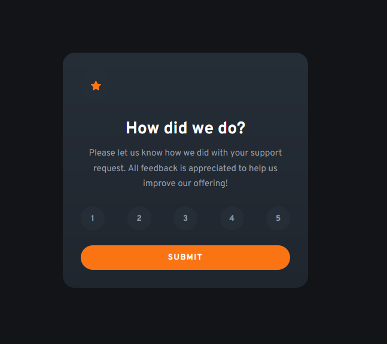

# Frontend Mentor - Interactive rating component solution

This is a solution to the [Interactive rating component challenge on Frontend Mentor](https://www.frontendmentor.io/challenges/interactive-rating-component-koxpeBUmI). Frontend Mentor challenges help you improve your coding skills by building realistic projects.

## Table of contents

- [Overview](#overview)
  - [The challenge](#the-challenge)
  - [Screenshot](#screenshot)
  - [Links](#links)
- [My process](#my-process)
  - [Built with](#built-with)
  - [What I learned](#what-i-learned)
- [Author](#author)

## Overview

### The challenge

Users should be able to:

- View the optimal layout for the app depending on their device's screen size
- See hover states for all interactive elements on the page
- Select and submit a number rating
- See the "Thank you" card state after submitting a rating

### Screenshot

### Links

- Solution URL: [Solution URL here](https://card-ratings.netlify.app/)
- Live Site URL: [live site URL here](https://github.com/naveen-p08/interactive-rating-react)

## My process

### Built with

- Semantic HTML5 markup
- CSS custom properties
- CSS Grid
- CSS modules
- [React](https://react.dev/) - JS library
- [Vite](https://vitejs.dev/) - Frontend Tooling library

### What I learned

This is a very simple project to practice with passing state and functions as props to child components and understand how they work. also good starting point for practicing css modules

## Author

- Website - [Naveen](https://naveenp.dev/)
- Github - [naveen-p08](https://github.com/naveen-p08)
- Frontend Mentor - [@root9259](https://www.frontendmentor.io/profile/root9259)
- Twitter - [@naveen_p08](https://twitter.com/naveen_p08)
